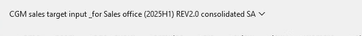

# AFLA_Breifing_20250704-08

- Blank sailing
    - Seasonal なもの
    - Chinese new year
    - 

**アジア ➜ 中南米西岸（Latin West Coast）向けサービスを担当するプライシング／スペースコントロール部門の仕事の流れ**

| テーマ | キーワード | ざっくりポイント |
| --- | --- | --- |
| ① 業務フローと会議体 | Salesforce投稿、BCP会議、China Sales会議、管理会議 | 情報を「いつ・誰に・何で」共有するか |
| ② 料金・契約管理 | FAK／Tier-1、S–M–L 比率、One Code、CM/TEU 660 USD | 料金をどう決め、どこまで値下げするか |
| ③ イレギュラー対応 | Blank Sailing／Vessel Cascading、COD、DD、SOC | 船の欠航や荷主の変更要求にどう対処するか |

---

## ① 日次・週次の情報共有フロー

| 曜日 | 会議 | 参加者 | 中身 |
| --- | --- | --- | --- |
| **火曜** | BCP（Business Continuity Plan） | チーム内（Pricing＋Space） | 各ループのスペース充填率・ロールプール状況を共有し、課題を相談 |
| **水曜** | Management Meeting | 本部長 (BH)・Trade Management | 週間マーケット情報・スペース現況を報告し、料金方針を調整 |
| **木曜** | C-Meeting | 中国・日本のSales Office | 現地の需要感や競合情報を受け取り、空船対策や販促策を共有 |

### Salesforce の「Service Scope」ページ

- ① FAK・MRG レートをまず Salesforce にアップすること。② それ以外のトレードディレクションやアナウンスもすべてここに掲載します。
- **レート更新や新サービス、欠航（Blank Sailing）告知**をここにポスト。
- 船腹が埋まらない特定本船向けに **販促キャンペーン** も発信。

---

## ② 料金体系と販売戦略

### 1. 料金階層

| 階層 | 定義 | 割引幅 | 対象顧客 |
| --- | --- | --- | --- |
| **FAK** (Freight All Kinds) | すべての一般貨物に適用する基準運賃 | ― | フォワーダー・直荷主どちらも |
| **Tier-1** | 安定して<ins>週30 TEU×3 か月</ins>以上出荷する顧客 | FAK から **▲100 USD/TEU** | 大手 BCO 等 |

その他キャリアには複数ティアがあるが、当トレードは「FAK＋Tier-1の２段階」で運用。

### 2. 契約期間でみる３分類

| 区分 | 期間 | 目的 |
| --- | --- | --- |
| **Short Term** | 〜3 か月 | 市況連動・スポット対応 |
| **Mid Term** | 3–6 か月 | 四半期ごとの量確保（Forwarder NAC など） |
| **Long Term** | 6 か月超 | BCO 年間入札・収益安定 |

### 3. S-M-L ミックス（BSA 11,000 TEU/週が前提）

| 目標比率 | 背景 |
| --- | --- |
| **Long 36 %** | 容量急拡大への保険。2024年 ≈21 %→2025年目標を 36 % に引き上げ |
| **Mid 8 %** | “名寄せ”案件は需給操作しやすいが、過度に与えない |
| **Short 56 %** | 市場価格でフレキシブルに埋める部分 |

### 4. 値決めの「採算ボーダー」

- **CM / TEU = 660 USD**（または **66 USD/t**）
    
    チャーター料と燃油を含む損益分岐点。
    
- **EPPA / EPPB** で機器コストを上乗せ（Tender = EPPB、Spot = EPPA）。

### 5. One Quote (オンライン即決プラットフォーム)

| 機能 | 社内の使い方 |
| --- | --- |
| 先着順で枠確保／即ブッキング | 需要テスト用「バッファ」。枠を増減し、市場温度を探る |
| **特別割引＋キャンセル時ペナルティ** | 10 日前以前のキャンセルでもペナルティを請求（自己防衛） |

---

## ③ イレギュラー対応と各種コスト

### A. Blank Sailing / Vessel Cascading

| 用語 | 意味 |
| --- | --- |
| **Blank Sailing (ブランクセイリング)** | その週に船を出さず欠航すること。需要低迷期（旧正月前後・Golden Week など）に行う |
| **Vessel Cascading** | 船を別航路に一時転配し、次サイクルで戻す |

### B. Change of Destination (COD)

| 項目 | 額 | 説明 |
| --- | --- | --- |
| **手数料** | **400 USD / B/L** | 事務手数料、港に関わらず固定 |
| **リストア料** | 500 USD × リストア回数 | 積替え・積戻し作業。対象港により異なる |
| **差額運賃** | 距離差に応じ再計算 | Mazatlán→Lázaro C. など |

COD Fee Usd400/BL

Restow Usd500/unit x no. of restow

※判断手順

①Booking Inquiry で積載状況確認 → ②パートナー船社/オペへ可否照会 → ③費用試算して営業へ回答。

### C. Detention & Demurrage (DD)

- **Demurrage** ＝ターミナル内でのコンテナ滞留
- **Detention** ＝ターミナル外（搬出後）の滞留
    
    → 当トレードでは **“Combined” で 21 暦日フリー**（Mexico）。22日目から 165 USD/日。
    

**免除権限**

| ポジション | 上限 |
| --- | --- |
| Pricing Manager (Soon Ang) | 5,000 USD/B/L |
| Senior Manager (Simon) | 10,000 USD/B/L |
| それ以上 | Trade Head へエスカレーション |

### D. SOC (Shipper’s Own Container)

- 自社コンテナ優先のため **受入は限定的**。FAK ＋ 100 USD/TEU が目安。
- **High-Cube SOC** は ISO サイズ保証＋２本ペアでのハンドリング必須。

---

## 使うツール・ファイル類（リンクは社内共有済み）

| 用途 | システム／ファイル | メモ |
| --- | --- | --- |
| マーケット更新 | *China Market Update* Sheet | 需要・供給・Blank Sailing 情報 |
| コスト計算 | *Pricing Simulation* (Excel) | Equipment Type を切替え可 |
| Long-Term Schedule | *West Coast Long-Range Berthing* | 構造的な欠航計画を確認 |
| Inland Tariff | *LATAM Inbound DHC/ARD* | チリ・メキシコなどの陸送コスト |
| 見積テンプレ | *Standard Spot / Tender / OG Format* | OBS・PSS・Validity を必ず明記 |

---

## まとめ

1. **毎週火曜 BCP、木曜 China Sales、水曜 Mgmt** — 会議で聞くべきポイントを事前に整理する。
2. **Salesforce「Service Scope」最新投稿は毎日チェック。** 欠航や販促がすぐ分かる。
3. **料金は FAK と Tier-1 だけ。** Tier-1 へ落とす判断基準（30 TEU×3 か月）を覚える。
4. **CM/TEU 660 USD が損益分岐。** 見積時は必ず Simulation で確認。
5. **S-M-L 比率目標（36 / 8 / 56 %）と Reefer・OG 週間ノルマを念頭に。**
6. **One Code で需要を先読み。** キャンセル料ルールも理解して顧客へ伝える。
7. **イレギュラー対応（COD、DD、SOC）は費用構造を丸暗記。** 即答できると信頼度アップ。

**Soon Ang Chong**:
Sales Force では実質的に 2 つのことだけを行っています。メインは **FAK/MRG（Freight All Kinds / マーケットガイド）レートを最初に Salesforce にリリース** することです。ここが私たちのメインの「サービススコープ」ページで、すべてのトレード方針やアナウンスをここに掲載します。レート改定があれば Trade Marketing Direction へ、ジョブスコープの変更があればその旨をここで通知します。

例えば中古車レート、O/Bunker（燃料割増）レート、LING Job Off Charges などの変更情報もここで確認できます。また、特定の本船や仕向港（POD）の積載率が低い場合、Sales Force 上でキャンペーンをリリースし、各営業担当（Sales PIC）へ空きスペースがあることを知らせることもあります。

---

## 

**Soon Ang Chong**:
そう。毎週火曜に **社内 BCP（Business Continuity Plan）ミーティング** を行い、Simon と Mansan にスペース状況などを共有します。チーム内での注意点や質問もそこで扱います。

木曜には **C Meeting** を開催し、中国の C チームおよび日本の同僚と情報交換します。現地のフィードバックや、我々のスペース状況、サービス変更点などを共有します。

水曜は **Management Meeting**。BH（部長）と Trade Management 全員が集まり、その週のマーケット情報とスペース状況を報告します。木曜の C Meeting で決まった変更点を受けて、必要があればここで最終調整します。

---

## 00:02:38〜 Blank Sailing とは？

**Soon Ang Chong**:
この "market updates for China" には、容量（capacity）、Blank Sailing、Extra Loader などの情報が更新されます。ところで **Blank Sailing（ブランクセイリング）** の意味は分かりますか？

**Soon Ang Chong**:
従来、海運スケジュールには**季節変動**があります。典型例は旧正月（1〜2 月）。中国の工場労働者は長期休暇で帰省します。

その週は工場が閉まり輸出が止まるので、**キャリア各社は船の運航を止め（＝Blank Sailing）** ます。休暇前は大口荷主（BCO）が出荷を前倒しするので需要がやや強まりますが、場合によっては発注を先送りする企業もあります。

休暇明けの生産回復ペースも読みにくいため、私たちは通常期でも毎週、中国 SE とミーティングを行い需要を確認しています（旧正月期間を除く）。

Blank Sailing には 2 つの種類があります。

1. **Structural Blank** – 長期スケジュール上で最初から欠航を織り込む。
2. **Vessel Cascading** – 船を別航路へ一時転配し、次のサイクルで戻す。

AX1/AX2 ではよく欠航しますが、日本顧客の多い AX3 は極力避けます。

---

## 00:07:29〜 ロングタームスケジュール

工場稼働が止まる大型連休は旧正月のほか、5 月労働節（Labor Holiday）や 10 月初旬の **国慶節 Golden Week** も要注意です。東南アジアのラマダン前後も同様に需要が凸凹します。

---

## 00:08:47〜 料金体系（FAK と Tier‑1）

**Soon Ang Chong**:
当トレードのレート階層は **FAK** と **Tier‑1** の 2 段階だけです。他キャリアや他トレード（EU/TP）は Tier 0, Tier 2 など複数ありますが、AFLA Latin West では 2 つに集約しています。

- **FAK** = Freight All Kinds（貨物種別を問わない基準運賃）
- **Tier‑1** = FAK から **▲100 USD/TEU**

Tier‑1 昇格条件（従来）：

- FAK で **週 30 TEU を 3 か月連続** —— 安定大口であること

ただし今年は増船でキャパが拡大したため、次回 CGM で条件見直しが議論される見込みです。

### 契約期間の定義

| 区分 | 期間 |
| --- | --- |
| **Short Term** | ～3 か月 |
| **Mid Term** | 3～6 か月 |
| **Long Term** | 6 か月超 |

私は個人的に 1 年契約を好みます。6 か月契約だと手間が倍増するうえ、市況変動に対するリスクヘッジが弱いからです。

---

## 00:13:25〜 レート改定サイクル

FAK は市場レートに合わせて **毎月前半に 2 週間分をリリース**、必要に応じて月後半も更新します。Southeast Asia（SEA）サイドは月曜の Front Office 会議後にレートをまとめるため、**隔週（Bi‑weekly）更新** が基本です。

---

## 00:15:59〜 SML 比率とターゲット

CGM/CS で共有しているファイルを参照してください。今年の目標は：

- **Long Term 36 %**
- **Mid Term 8 %**
- **Short Term 56 %**

昨年の Long Term 実績 20–21 % → 今年は BSA が週 11,000 TEU に増えたため、安定貨物を厚くする狙いです。

---

## 00:20:08〜 Name Account の扱い

- フォワーダー新規取引基準：**まず FAK で年 1,000 TEU** を達成してから Name Account（NAC）を 1 件付与
- NAC と Long‑Term BCO が競合しないことを確認
- バスケットレート（雑多な貨物を一括り）は原則拒否

---

## 00:22:33〜 One Code（オンライン即時予約）

- **BSA バッファ兼 市場温度計** として運用
- 需要が読めない時期に Allocation を増減し、市況をテスト
- 特別割引を設定しつつ、**キャンセル時は時期を問わずペナルティ徴収** で自衛

---

## 00:24:52〜 メキシコ貨物比率の調整議論

2024 年に Mexico 向け比率が上がりすぎたため、WCSA/WCCA へシフトする議論もあったが、港混雑・ターミナル制約の影響で再検討中。

---

## 00:27:20〜 コスト計算の基本

- **CM/TEU 660 USD** が損益分岐点（チャーター料＋燃料込み）
- EPPA/EPPB = 機器コスト（スポットは EPPA、長期 Tender は EPPB）
- Pricing Simulation で貨物タイプを選び、コストを確認

---

## 00:32:52〜 内陸コスト

- LATAM Inbound DHC/ARD 表を参照（RHQ Inland Pricing が管理）
- 例：サンアントニオ港→サンティアゴのトラックコスト

---

## 00:34:12〜 オファー判断フロー

1. まず **FAK** を提示
2. 目標レートが低い場合：
    - スペース余裕（Roll Pool）とターゲット POD を確認
    - CM/TEU が 660 を下回らないか、市場スポットレートと乖離しすぎていないか検証
3. 必要なら Spot Rate を出すが、**市場を壊す水準にはしない**

---

## 00:38:55〜 見積テンプレート

- Spot/Short/Long すべて同一フォーマット
- 可能な限り **OBS（燃料調整金）と PSS（ピーク時割増）** を条件付きで入れる
- **有効期限（Validity）** は絶対に記載——後日「同じレートでOK」と言われるトラブル防止

OG（Out‑of‑Gauge）貨物は **Under‑Deck Storage** ベースの別テンプレ使用。

PPP（Premium Priority Protection）は FAK＋2,500 USD/Unit のスペース保証商品。ただし現行市況では調整額を軽減して運用。

---

## 00:44:18〜 Booking Inquiry の使い方

- BL/Booking No. を入力すると Shipper/Consignee、コンテナサイズ、DG（危険品）／Reefer などが確認可能
- "Route Detail" で実際の搬送ルートをチェック

---

## 00:45:21〜 COD（Change of Destination）手続き

- **標準 COD Fee：400 USD/BL**（仕向港に関係なく事務手数料）
- 積替え（Restow）が必要な場合：**500 USD × 回数**
- 追加運賃差額＝旧 POD→新 POD の距離差で算出
- パートナー船の場合は Offshore COD Team が処理、自社船は自部門で手配

---

## 00:52:05〜 DD（Detention & Demurrage）

| 区分 | 場所 | 初期フリータイム |
| --- | --- | --- |
| **Demurrage** | ターミナル内 | 21 暦日（FAK, Mexico） |
| **Detention** | ターミナル外 | 同上（Combined 方式） |

22 日目以降：165 USD/日・箱。免除権限は Soon（5k）、Simon（10k）、それ以上は Trade Head 承認。

> ストレージ fee（Terminal Storage）はターミナルが荷主に直接課金。船社は負担しないので注意。
> 

---

## 00:58:23〜 SOC（Shipper’s Own Container）方針

- 自社コンテナ優先のため SOC は限定受入
- FAK＋100 USD/Unit を目安、フリータイムは最小限
- High‑Cube SOC は **ISO 規格 & CSC Plate 有効** を確認し、2 本ペアでハンドリング

---

## 01:00:49〜 CSC Plate とは？

CSC（Container Safety Convention）プレートには製造年、耐荷重、積み重ね荷重などが記載され、クルーやターミナルが安全に積載できるか判断するために必須です。

；

- 

### イントロダクション Part 3 のポイントまとめ

（AFLA Trade ― Pricing & Space Control オンボーディング）

---

### 1. 料金計算と規制

- **FMC 対象外（Non-FMC）航路**
    - アジア ⇄ 中南米（Latin West）は米国 FMC （米国連邦海事委員会）提出義務なし。
    - 運賃計算ロジックは「**最初の積出港の ETD（出港予定日）**」を基準にします。
        
        ここで言う ETD は**実際の出港日（Actual ETD）ではなく、プロフォーマ（予定）ETD**
        
        です。
        
    - 従来は Actual ETD が業界の一般慣行でしたが、COVID 期にリスクと運賃の乱高下が激化。
    
    Actual 基準だと出港遅延のたびに運賃がさらに上昇し、荷主の不安が増すため、**予定 ETD 基準** に切り替えました。ただし欠点もあって、**市況が下落局面に入ると荷主は Actual 基準を好む** 傾向があり、一長一短です。現時点では SYM（本社）から他の指示がない限り、**予定 ETD ロジックを維持** します。
    
    - 例外――
        - **港抜港（Port Omission）** や **弊社都合でロール** した場合など、商業判断で Actual ETD へ修正することがある。
            - 例：前週の本船から翌週の本船へロールすると、元の週の予定 ETD では不整合が出るため、実際に積む週へ変更。
        - 一部顧客から「当初の予定日へ戻してほしい」と要望が来ることもある。対応可否は完全にコマーシャル判断。
    - **運賃発効日**は *実 ETD* ではなく **予定 ETD（プロフォーマ）** を採用。
        
        「暫定・仮・予定値」という意味で使われます。海運のスケジュールにおける **pro forma ETD** は、船社が事前に公表している運航計画（回航表）上の **予定出港日** を指します。
        
        ---
        
        ### なぜ「プロフォーマ ETD」を使うのか
        
        | 項目 | プロフォーマ ETD | アクチュアル ETD |
        | --- | --- | --- |
        | 定義 | 公表された計画上の出港日 | 実際に船が岸壁を離れた日時 |
        | 目的 | 料金発効日や契約条件を安定させる基準 | 遅延・繰上げを含めた事実記録 |
        | メリット | - 荷主は事前にコストを把握しやすい- 船社はレートを早期確定できる | - 実態ベースで正確 |
        | デメリット | 実際の遅延・前倒しとはズレる可能性 | 運賃が頻繁に変動し荷主の不安要因に |
        
        > ポイント：COVID 期のように運賃が急騰する局面では、
        > 
        > 
        > アクチュアル ETD を基準にすると “船が遅延するたびに発効日が後ろ倒し → さらに高い運賃が適用”
        > 
        > となり、荷主が読めなくなります。そこで **「予定（プロフォーマ）に固定」** して
        > 
        > レートを安定させる運用に切り替えた──というわけです。
        > 
        
        ---
        
        ### 実務イメージ
        
        1. **船社公表スケジュール**
            - 例）MV ONE TRUST V.001W
                - Shanghai ETD **7月10日（Pro forma）**
        2. **ブッキング時点のレート判定**
            - 「7/10 予定出港」なので **Week 28 Tariff** を適用。
        3. **実際の出港**
            - 荷役遅延で 7/12 に出港しても、料金は **7/10 基準のまま**。
        
        ---
        
        ### まとめ
        
        - **pro forma = 予定・暫定値**
        - 海運では **公表回航表の ETD/ETA** を指す。
        - 運賃・契約面での安定を重視する場合に基準日として採用される。
        - COVID 期に運賃が高騰し、荷主の不安を和らげるために変更。
        - 例外：港抜港・弊社都合のロール時などは実 ETD へ修正可（商業判断）。
- **MOT（中国交通運輸部）上限申告**
    - COVID 期に運賃が高騰したため、事前に「上限設定」を提出し、**上限を超える場合は 30 日前通知**が必須。現在のキャップは**約 13,000 USD/40’**と非常に高い水準。
    - 中国発 US 向け主要 4 ベースポート（例：上海外高橋など）は
        
        レートキャップを MOT に30日前通知。現在上限 ≒ **USD 13,000/40’** と高め。
        
    - **Tiger システム**でファイリングが間に合わない場合、MOT の**SSE ルール（出港 24 時間前までに登録完了）**に抵触し、再登録（re-link）が必要になることがあります。その際は FAK 運賃ベースで手動承認を求められるケースも。
    - Tiger で申告漏れがあると再申告（re-link）が必要になるので注意。
- FMC と MOT は混同しないでください。
    - **FMC**：米国航路（US in/out）専用。Service Contract (SC) を FMC へ電子申請。
    - **MOT**：中国発の主要 4 ベースポートで THL・ターミナル料・運賃を申告。

当社の Non-FMC 航路では **RFA Contract**を主に使用しますが、必要に応じて SC 形式も利用可。

「Contract No. が SC で始まるからといって必ず FMC 対象とは限らない」点に注意してください。

---

### 2. 営業目標設定フロー

| フェーズ | 主な内容 | 期間感 |
| --- | --- | --- |
| **CGM（Sales Meeting）** | 前年実績を基に半年ごとに **各国・営業担当の取扱 TEU 目標** を決定。 | 年 2 回（1Q, 3Q） |
| **AP（月次 Account Plan）** | CGM 目標を週次船腹（BSA）に落とし込み、**各オフィスへ月次配分**。7 月中旬に翌月分を FIX。 | 毎月 |
| **3 か月レビュー** | 実際のリフティングが未達なら配分を減枠、好調なら増枠。 | 四半期 |

---

- 8 月の AP（Allocation Plan）は **7 月中旬で確定**。確定後は原則変更しない。
- CS（カスタマーサービス）や顧客には、その期間の割当が可視化される。
- 確定した AP に対して、月次で「達成状況」をチェックし、必要に応じて次回 CGM で見直し。
- 例：メキシコ向け 500 TEU を割当。
    - 初期目標合計 1,128 TEU に対し **600 TEU オーバー** したため、再度 “Revision Meeting” を実施し、各国配分を削減。
- AFLAでは **Tiger へのレートアップロード** を自部門で行うが、他トレードは OMMC任せの場合も多い。
- スペースマネジメント体制もトレードごとに異なる。

### 3. スペースコントロールの優先順位

1. **特殊・高コスト貨物**（リーファー／OG／DG など）
2. **“Do Not Roll” 指定顧客**
3. **ロール済み AP 顧客**（前週ロール分を最優先処理）
4. **当週 AP 顧客**
5. **非 AP（FAK）貨物**

> ロールは基本 1 週（最大 2 週）以内に解消。Chinese New Year など例外を除き 3 週以上は不可。
> 

**AP ≠ ローディングアロケーション**

- AP は「顧客への事前割当」の意味合いで、実際の船スペース配分は **本船 BSA（ベーシス）** に応じて **Ratio Up / Down** を行う。
- 小型船なら AP 比率を減らし、大型船なら増やす
- **AP がある＝100% ロールしない**わけでもなく、単に「積み込み優先順位が高い」ことを示すだけ。スペース管理上の最優先は特殊貨物や DG、リーファーなど。保管コストが高く、パートナー線でもロール不可のケースがあるからです。
- ロールは**理想は 1 週間以内、最大でも 2 週間**。3 週間以上は不可（旧正月の B-Pool など特別な理由がある場合を除く）。SM（Space Management）の KPI では**ターゲット 7 日**と定めています。
- 現在、AP は Google Sheets で一元管理されています。共有ドライブの**「AP LW AP」フォルダ**
    
    を開くと、国別タブがあります。（例）私はメキシコ担当なので**Mexico AP**を開き、8 月分（締切 7/10）の入力をチェックします。Front Office から集めた月次 AP を見ると、CGM で配分した 500 TEU に対し、実際の申告は 57 TEU しかありません。そこで「もっと積めそうか？」とまず確認します。必要なら顧客別に Drill-down し、過去実績と比べて過大／過小を修正させます。逆に 520 TEU のように超過入力している場合は、どのアカウントが過大かを特定し、削減を依頼。営業が“守りたいアカウント”を抱え込み、新規開拓が進まない悪循環を防ぐためです。
    
- AP を確定すると、BK が Standby システムの **Master Constraint Table** にアップロードし、スペースコントローラが取り込みます。
- **AP 顧客** とは長期契約または定期的に荷物を出す顧客のことで、条件を満たせば自動リリースされます。
    - 例：上海向け AP ＝ 20 TEU／週 の顧客が **出港 10 日前までに 1 TEU** をブッキング → 即時リリース（GT4）。
    - 20 TEU を超えたり、10 日を切ると AP 効力が失効し、Waiting List へ落ちます。
        
        ポート間の AP 振替はシステムが硬直化するので、基本的に許可しません。営業からは「システムが柔軟性に欠ける」と言われますが、予測精度とスペース有効利用のためには一定の硬直も必要です。
        

### GD コード

- **GD4** = 通常モード（AP 顧客のみ自動リリース、10 日前まで有効）
- **GD1** = 全面開放（ブッキング不足時に使用）
- **GD6** = 受託停止／上限設定（例：20 TEU 以上は拒否）
- 通常週は GD4、スペース不足時は GD1 を開け、市況悪化時や特定 POD を止めたい時は GD6 を使います。

---

### 4. Tiger & RFA（Rate Filing）

- **Tiger**：前線営業からのレートリクエストを承認・却下。
    - 承認後、自動で **RFA Proposal** に登録。
    米国航路の **Service Contract** は別メニューで確認します。
    - **短期（スポット）** と **長期（契約）** は RFA を分離し、実績分析を容易に。
- 例）大連→サンアントニオ・カヤオ向け 1,800 USD（NR レート）を申請。

FAK が 2,500 USD なのに特価を出すのは、空コン需要のため NORを送りたいから。

- 短期契約では **OBS（Bunker）や PSS（Peak Season）** を付加。
- **Looker レポート**：日次リフティングや貨物構成を可視化。
- **共有ドライブ（Google Sheets）**：CGM／AP／Tender 進捗を一元管理。

---

> ⚓ 要点：
> 
> - レート発効は「予定 ETD」基準、MOT キャップあり
> - CGM → AP → 3 か月レビューで目標を段階管理
> - スペース優先順位と GD コードでロール最小化
> - Tiger／RFA／Looker を活用しデータドリブンで判断

サーチャージについてAll inとSuper all inの違いは？
**ChatGPT said:**

とても良い質問です。

海上運賃でいう **「All in」** と **「Super All in」** は、どちらも複数のサーチャージ（付帯料金）を**基本運賃（Base Freight）に含めた料金体系**を指しますが、**含まれる範囲の広さ**が異なります。
**🚢 All in**
• **意味**：Base Freight に主要な海上サーチャージ（BAF、OFC、LSS など）を**まとめて含めた料金**
• **含まれる主な項目**
    ◦ BAF（Bunker Adjustment Factor）
    ◦ LSS / LSF（Low Sulphur Surcharge）
    ◦ OBS（Operational Bunker Surcharge）
    ◦ THS（Terminal Handling Service）※Origin 側のみ含む場合も
• **別途請求されることが多いもの**
    ◦ Destination THC（着地側THC）
    ◦ DDC（Destination Delivery Charge）
    ◦ Local Charges（DOC Fee, Seal Fee, AMSなど）💡イメージ：

「All in = 海上運賃＋主要サーチャージ込み」
**🛳 Super All in**
• **意味**：「All in」よりさらに広く、**ほとんどのサーチャージを含めた完全一括運賃**
• **含まれる主な項目**
    ◦ All in に含まれる項目すべて
    ◦ Origin / Destination THC（両方）
    ◦ DOC Fee、Seal Fee などのローカルチャージ
    ◦ 一部では ISPS, PSS, EBS, GRI なども含む
• **別途請求が基本的にない**
    ◦ 「トータル金額を提示したい顧客向け」に使われる💡イメージ：

「Super All in = ほぼすべての付帯費用込みのワンプライス」
**📊 比較まとめ**項目All inSuper All inBAF / LSS / OBS含む含むOrigin THC含む（多くの場合）含むDestination THC別途含むLocal Charges (DOC, Seal Fee 等)別途含む透明性高い（項目別明示）低い（ワンプライス提示）利用目的通常契約・見積り用顧客への総額提示・特定プロモーション