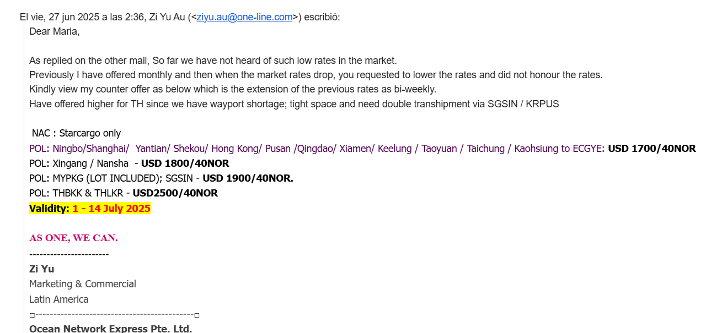

# AFLA_Breifing_20250708

- APについて
    - Pusan船がでることをClosing
        - その前までに満船にする、かつ、溢れたときにどれを切るかを明確にする
    - G:\Shared drives\LW AP\3_Finalize_AP
    - ここで担当の国が終わってるか確認する
    - 基本は営業が直す
    - Warningが出ている場合はエラー箇所を指摘する
        - 先月と比べて大きな変化があるか
        - Actual liftingで実際に乗せているか
    - AP Summary Standardのシート
        - TEU allocation/BSA→SimonがInputした。CGMで話し合われたTarget
        - 30％くらい多かったらSimonにシェア
    - 船積み実績が全然ないケースがある
        - RFA No.が正しくない可能性がある、実際にはLiftingがある
        - Sales Officeに確認する（返信ないケースもある）
    - AP→各国のBSAをOPUSにアップロードする
    - AX1
        - HLC　８
        - ONE　３
        - HMM　１

基本BSAは一番少ないキャパシティにあわせる

ONEの船だと余分のスペースがある＝オーナーズメリット

翌週にどれくらい

FAKはここ

G:\Shared drives\Latin West Coast\LAWC Rates guideline

上記で作ったものがSimonがONE ForceでPublishしている

- ALL TM Directions→Created Byで並び替え→Simonを探す

### エクアドルPricingの話

- 運賃の登録はTiger
- TigerからのメールはTO 増田（担当者）でCCはAFLAにしたい
- Tigerの設定変更
- MAVIJYUのFilingのリクエストを受領
    - 過去のメールでやり取り確認
    - ZiyuはこれでOffer。StarcargoはTier1でこれに+１００が本来のはず
    
    
    
    - 他のメールも確認して、StarcargoにいくらでOfferしているかは継続Watch
    - MRGのものはそのままでOK
    - MRG以外は上記のメールにアラインしているか確認する
    - XingangとCNTSNは同じところを指す
        - 
        
        はい、**Xingang（新港）とCNTSNは基本的に同じ場所を指します**。以下に詳しく説明します。
        
        ---
        
        ### 🔹 CNTSNとは？
        
        - **UN/LOCODE**での正式コード：**CNTSN**
        - **意味**：**Tianjin（天津）**を表す港コード
        - 天津には複数の港エリアがありますが、国際海上コンテナの主なゲートウェイは「新港（Xingang）」です。
        
        ---
        
        ### 🔹 Xingang（新港）とは？
        
        - **漢字名**：天津新港（Tianjin Xingang）
        - **英語表記**：Xingang Port（またはTianjin Xingang Port）
        - *天津港（Tianjin Port）**の主要なコンテナターミナルエリアの名称
        
        ---
        
        ### ✅ まとめ：実務上の関係性
        
        | 項目 | 内容 |
        | --- | --- |
        | **CNTSN** | UN/LOCODE（Tianjin港全体を指す） |
        | **Xingang** | CNTSN内の主要なコンテナ港エリアの名称 |
        | **実務での使われ方** | ブッキングやBLでは「CNTSN」を港コードに使い、現地CYなどの地名として「Xingang」と記載することが多い |
        
        ---
        
        ### 🔸例（Booking画面での見え方）
        
        - **Port of Loading (POL)**：CNTSN
        - **CY/CFS Cut**：Xingang terminal
        - **Free Time表記**：Xingang (CNTSN)
    
    ---
    

- 2800
- Kawasaki->IQQ (30TEU)
- 
- COSCOはT1をMD
- CMAはDiamondと言ったりする
- HLC got 3 tier

　　FAK / Tier 1  / Tier 0

　　Tier1 -50 / Tier 0 -100

　　So their Tier 0 - similar to our Tier 1

Show up ratio（ショーアップ率）」について

- 「Show up」は中国オフィスや前線オフィスによる予測のことです。
たとえば、確定予約が100TEUで、「show up」が50%と記載されていれば、それは50TEUがゲートインするという予想を意味します。
これが例えばBSA 50TEUに対してであれば、ロールオーバー（積み残し）はなしとなります。
- もしショーアップ率が、積極的なレート調整などを背景に60%に上がると予想される場合、
結果として10TEUのロールオーバーが発生することになります。
これらはすべて、その週が近づくまでは仮定に基づくものです。
通常、CY（コンテナヤード）のゲートオープンは船の到着の約3〜5日前なので、
空コンテナのピックアップ状況により、より正確な予測ができるようになります。
その後、ゲートインされた数値に基づいて、船の締め作業の際に数字を確認します。
今週＋1週目＋2週目＋3週目までは、ピックアップ率やショーアップ率などに基づいた推測しかできません。

- Rate Validity
    - Rate:1500
- Offer Validity
    - Filingの期限

- メキシコは電気代などを船社ではなくお客さんに直接請求する

LAX

- 船がついて48時間以内だったら請求しません。それ以降だと蔵置料を請求する（デマレージ）
    - ターミナルは船社に請求する、それをお客さんに請求する
- お客さんのトラックがピックアップをしてそこから7日日以内だったら不要。それ以降だったらチャージ（ディテンション）
- 船から降ろされてから港においてて、返ってくるまでで14日間（Combined）：メキシコはCombined、南米はCombinedが多いがメキシコが有名
- DAR
    - D&D Approval？
    - 14日→21日にのばせる（14日にしていても、実態はお客さんの要求に応じて21日までは伸ばすのをOKにしていたりする）
- 

LOFFのPrice

- OPUS

[Opus Walkthrough.pptx](AFLA_Breifing_20250708/Opus_Walkthrough.pptx)

MRGのダウンロード方法

[無題](AFLA_Breifing_20250708/%E7%84%A1%E9%A1%8C%2029b0630b6bdc80819195edb755c6aa70.csv)

**It looks like this message is in English**

Dear Muriel,

1) Go to sales force

2) Click follow ALL - WEST COAST SOUTH AMERICA (EB)

3) Go to related Trade and Mtkg Direction ; find the latest FAK MRG and download it.

[image.png](https://mail.google.com/mail/u/0?ui=2&ik=d2b5fbf673&attid=0.1&permmsgid=msg-f:1847279748705991149&th=19a2db24e664b9ed&view=fimg&fur=ip&permmsgid=msg-f:1847279748705991149&sz=s0-l75-ft&attbid=ANGjdJ_fFyJ-kbHGybXpFpnWXxqCohyF0DsGJ54wIa9DvZHkkHjMJPPH9El8E9GW3VAMCH5U5tG3Q1SGf62yFQYOiVpg8qAeQboV1kifpiSQenaNi3jMh_pm2vw41k0&disp=emb&realattid=ii_mhbcl0m61&zw)

[image.png](https://mail.google.com/mail/u/0?ui=2&ik=d2b5fbf673&attid=0.2&permmsgid=msg-f:1847279748705991149&th=19a2db24e664b9ed&view=fimg&fur=ip&permmsgid=msg-f:1847279748705991149&sz=s0-l75-ft&attbid=ANGjdJ81YMSiHZd6zgteSOKkv7iJPLqqJdjLAYGeDtsXcFn8xIiPnfYFGgZDC2ceY-UvQKo2ns9PnIuAPIJ-ZPF7csmTA84dZoHEUaPLahb4UyHNG8S8bcXb4RplYq4&disp=emb&realattid=ii_mhbclf3m2&zw)