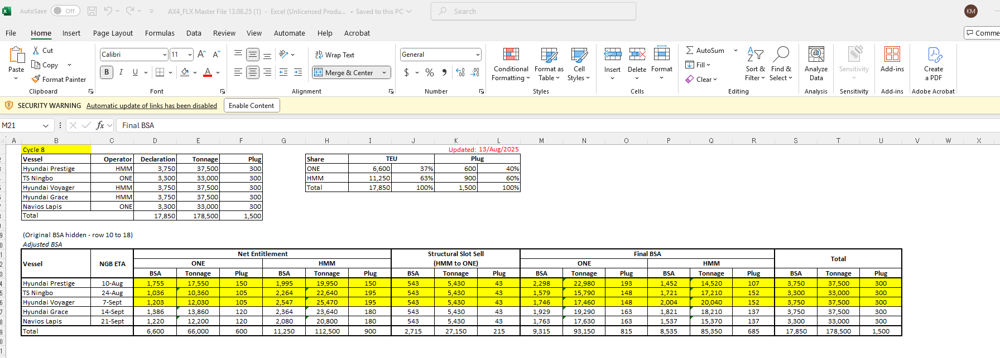

# W33

- 船が入ってしまった後も、WeightやTEUsでRollした場合（Standbyリストから切った場合）、その切った貨物をどの船に散らすか調整が必要。Billyにリストをもらう。
- BSAはCycleごとにJun Haoから連絡がくる。メール要注意
- 

- BSAが変わったらここをかえる。そしてメインシートのBSAを更新、Allocationのところでマニュアル調整して、Control by HOに登録する。
- 

- APがCompleteしているか確認する
    - さらに**AP Summary-Standardシートで90%ー120%くらいに収まっているか確認する**
    - 
    
    
    
- BKがAPをConsolidationしたらBKはここまでUpdateする
    
    
    
- このあと各船ごとのBSAをメインシートにしてAllocationをControl by HOにする
- それと同時にMaster Constrain TableにExcelをUploadする
    - このフォルダに各月ごとのUploadするEXCELが作られる
    - G:\Shared drives\Latin West Coast\Space Control\AX4\Standby\2025
    - 下3つは船を指定しながら1個ずつUploadする
    
    
    
    - 上2つはJPその下はONE Quote。これらは2ヶ月分登録する、
        - 前月登録した分を削除して、今月分をUploadする

- BSAはBKが作ったここから持ってくる
- 

- AX4 MXZLOは絶対Transhipなし

- Class 1と２が一番危険、HAZは７００ドルのアドオン。その他クラスは２００ドルのアドオン。ただし、Subject to　DG desk approval.

- MXZLOにreeferをもっていきたくない

- INCCUはコルカタ。Pricing simulationでTo Pusanを調べる

- please regularly patrol to see if there are any T/S arrangements via MXZLO on AX4.

- オーナーズメリット分についてはFront Officeに埋めさせるのはなく、我々のバックログからクリアする、すなわちAX1-3他の船のバックログから持ってくる（Fresh Cargoから持ってこないようにする）

- CGM meetingのシェア
    - Mexico
        - Can't see CGM target in Eagle and Salesforce
            - Latainリージョンは全体見れない
            - SYMにFIX依頼
            - ニカラグア、コスタリカ
        - Almir（２）
            - Longer Validityを希望
            - Qauteryに戻ろうとしている
        - MABE（１）
            - Tender 2026は1st roundは１２月
            - 
        - SAP For Seasons（３）
            - AX1とAX2にもっとスペースがほしい
        - クリアな理由がない限りキャンセルさせない
        - APのレビューについてレビューする
        - Capital logistic（４）
            - NACは３ヶ月のValidityを希望
            - From T1から落とす
            - ６０TEU/Weekを満たしていない
        - TRUPR
            - メキシコ
            - 11MTS HQ
            - Intra latainもある
            - Omissionがあったらコミュニケーションをしてほしい
                - 現在もみんなとしている
        - ４メイン顧客
            - S&PをProtectしてほしい、それ以外はRollしてもいい
            - Specialリクエストがある場合
    - ニカラグア
        - Sugar Shipment
        - Coffee
            - ２０GP
        - White goods (白物家電)
        - １ヶ月のValidityがほしい
        - 2 weekは短すぎる
        - Marexを埋める必要がある
        - ニカラグア door Legal limitでWeightが制限がある
    - パナマ
        - 嘘つかないで、Monthly meeting
        - ONE OfficeだからAggressiveに頑張りたい
        - ドララマがメインの顧客
    - サルバドール
        - Longer Validityが欲しい
    - グアテマラ
        - 半減した。Hondaを失った。
        - DepoでのOperational issue AT グアテマラが問題だった
        - かなりPICが入れ替わったりもした
        - Internal problem（二人のキーパーソンを失った）
        - ONE QuoteをPromoteしたい
            - ただ、Move countとDraft issueがある
        - GRS (BCO)
    - チリ
        - Pan South AmericaがTop顧客
        - Sumitomo Rubber
            - 3 month rate
        - バルパライソDraft issueは新しく5000で問題なくなった
        - 3 portsのレートは同じ
        - BSAがFixではないからすべての顧客をProtectできない、どれを選ぶかということを迫って、Push backしていい by Simon
    - ペルー
        - NOR
        - Heavy cleaningが必要になることが多い
            - いくつかはとてもお金がかかる
        - Recue NORかNo ファーとライザー
            - North Chinaからくる
        - Refer seasonはEnd of October to End of Feb
        - In retail farmer
            - テンダーだったが今はBiweekly, Monthlyベース担っている
            - Nextはテンダーになる
            - Cargo PriorityがLong Termだから、ペルーに不利。なぜなら彼らはLong TermがなくほとんどShort
        - DP Wall
            - Potentialの新しい顧客
        - 4 main customers
            - Hiraoka
                - Legacy時代からの顧客
            - Coulro text
            - Rumi center
            - 20GPが多い。２０GP をサポートするようにする。CMがいい。２０GPはHeavyだからCM/tonを見るようにする。　６0ドル/ton。
    - エクアドル
        - 52%NVO, 48%BCO
        - EV Carをみるようになる
        - General MotorがTOP　BCO
        - Gerado Opsi November 2024
            - Rate sensitive
    - ボリビア
        - IQQのUsed Car
        - Alica
    - コロンビア
        - 1つのアカウントしかないけどONEは100%のシェア
        - More D2
            - コヒーシーズン（Middle of year to end of year）
        - 石系を運ぶとコンテナはHeavy dagamae
    - チリとグアテマラはパフォーマンスがよくない
    - Average 1000USDのCM
    - チリは低い。なぜならNORがある
    - ペルーのCMは1100だが、Shortがほとんど。ある程度はLoadingできるようにサポートする。
- South East Asia
    - マレーシア
        - Sony Cargo
    - Indonesia
        - Potentialはバタム
    - India
        - Inaland rail
            - East<->West
        - Tranisitタイムも短い
    - タイ
        - Wayportスペースが欲しい
    - Singapore
        - 常にAP issue
        - PanasonicがパフォーマンスがないからDeleteする
        - HPがPanasonicをTake overする
            - ただ、HPはCredt IssueがあってこちらもSuspend
        - Mitsui
            - Monthlyベース
                - APに対してConsistantじゃない
    - Taiwan
        - Leader Oceranに90%頼っている
    - SPRC
        - Korea
        - Japan
            - ミスコミニケーション
                - Port omissionみたいななのがDestinationサイドに伝わっていない
            - OOGをもっと出すように
        - HK
        - Xiamen
    - Ningbo
        - Mint
    - Shanghai
        - 2nd halfは長期と短期を５０：５０に
        - Special Cargo
            - OOG applicationがわからない
            - By right, 5 days beforeだが、要確認
        - ChingDao
            - ハイセンスがPotetnail
            - D5
            - MonthlyかQuateluyベース
            - 最もNORをもっている。だからとてもHeavyとLow CM
            - 今はそんなNORいらないからもっと軽いCargoをと要請
                - それでハイセンス。とても軽い
            - China
                - SOE
                    - Govermnet owned Company
                - China Carreer
            - Nanjin
                - AX4をTryしてもOK
                - 紙、Very heavy、NO CM
                - 7000→5000に減らす
            - チョンチン
                - Inalnd costがIssue
                - High cost
                    - Inland
                    - Rail
                    - 800がEPコスト、InlandコストがすべてDomiサイドが負担している
                - ONEオフィスがある
                - コスコとMSCがとても強い
                - Light cargoが可能か聞いた
                    - 彼らが確認中
                    - MSCはDomesticの移動方法を持っている
            - 大連
                - グアヤキル