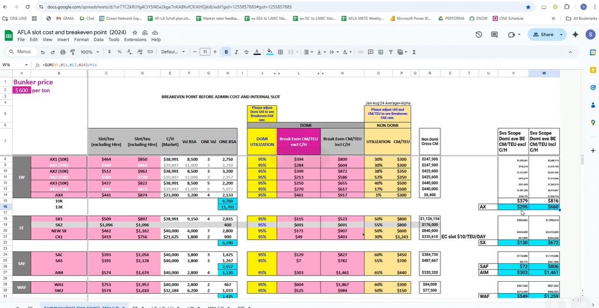

# W34

- Tenderについて

- CM breakeven pointを考える
- TenderはEPP Bを使う
- 

## 木曜日Meeting

- Space Situation
    - 最後にOverallを言う。Roll Poolの状況。マーケット状況を聞きたい。
- Japan space Nishimotoさん
    - AX1-4をUpdate。最後にBKにPassして、まとめてる
    - 3100/3600/3600 pending for review
- China
    - ECM Roberlto
    - Elyn
    - ECMのRate
    - 
    
    
    
- Ningbo Sales：Michelle
    - Market outlook
- Qingdao：Jason
- Dalian : Feng Li
- Issac : South PRC. Xiamen
- Penny
- Billy Wu
- 最後にまとめ
- Tier 3200, FAK33000
- 300 increase
- 9月7日まで
- マンザニーロ（10月はAggresive）
- Leader Ocean
- 1700　NOR　but refused
-