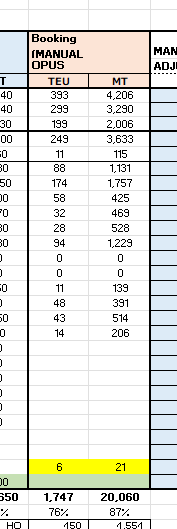

# WK30

- AX4のSpace/
    - HYVT0157E
        - Dharshinishreeから追加TEUを求められているが、すでにClose済み？なにかできるのか？→**Close済みだとどうにもならない**
        - 追加のMisconnection?by Dharshinishree
            - **Misconnection分を次の船でと言われることはあるが、基本はBSA遵守**
    - NLVT0007E
        - マレーシア：追加で34 teuを載せられないか、最終Loadingは36teus（Adeleのメール）
        - Dharshinishreeからも追加スペースの確認あり
        - Rollリストを作る？→作る
            - ここをControl by HOを使って最新の状況に更新
            - 
            
            
            
        - Control by HOからダウンロード
        
        
        
        - **↑Booking(Firm)とWeightにチェックをいれること**
        - ここの値に更新
        
        
        
        - 
        - ONE Quoteの数のUpdateの仕方
            - Control by HO
            
            
            
            - ↑Booking firmはゼロ
        - ここのマイナスの人たちに
            - Rollリスト送ることを依頼（ただしダイレクトポートは送らない）
            
            
            
        - 参考メール：AX4 HYVT0157E Roll List
        - 来週の月曜日にNLVTをClose
        - Wayport space application on AX4-NLVT0007E
            - Wayportタブの更新
            - 前VVDのBKGを確認
            
            
            
    - HIIT0111E
        - **MALAYSIA MARKETING**
            
            AX1  IMET2531E ,BSA 12 vs Loading 34 teus
            
            (6 teus AP bookings on this vessel, **22** **teus additional space required**)
            
            AX2  KDDT0530E, BSA 27 vs Loading 54 teus
            
            (17 teus AP bookings on this vessel, **27** **teus additional space required**)
            
            AX3  OSET2531E  ,BSA  26 TEUS vs loading 72 teus
            
            (30 teus AP bookings, **46 teus additional space required**)
            
            - AX4 HIIT0111E (additional 23 teus)  - to transfer 13 TEUS MXZLO bookings from AX2 ORIT2530E & 10 TEUS MXZLO bookings from AX2 OSET2531E
        - TGBT0021E
            - AX4 TGBT0021E (additional 55 teus) -  to transfer 40 TEUS MXZLO bookings from AX2 VTDT2533E & 15 TEUS MXZLO bookings from AX2 TKHT2534E
- SummaryファイルのUpdate
    
    As for AX4
    
    WK29, HYVT0157E, 
    
    Vessel expected to depart full in weight first.  Estimated around **100** teus of roll with 5TEUs of misconnection.
    
    WK30, No service
    
    WK31, NLVT0007E, ONE vessel. 
    
    Estimated to be full in weight with around **200** teus of Roll , subjected to no misconnection and shortfall.
    
    WK32, HIIT0111E, 
    
    Current sales projection **57**% current booking **43%**.  I will push the Front Office to input the forecast as usual.
    
    WK33, No service
    
- AX4のMXZLOのMove count

- Elynに上海、青島、ニンボウを合算でAPに収めてもらうようにいっている

- CLLのUpdate方法
    - ここのUpdate
    
    
    

EXCELでPivotするときにDELでMXを除く

同様にNGBとPUSも行う

- ここのUpdate
    
    
    

- ここのUpdate
- 

- 

- 
- T2は1でカウントしていい（SOC）
- F5はBooking NoをBooking Inquiryでいれる
- （2本のコンテナと10本のVoid）✕２

下のEXCELには合計24になるようにいれる

- ここのUpdate
- Elynに精緻な数を聞く, PUSはCatharine

それとは別にfinal figure tableを聞く

- ここをUpdateするため

## EC Pricing

- 今回LOFFが1900だからStar Cargoに1900-2000

NAC :

**Starcargo only**

POL: Ningbo/Shanghai/  Yantian/ Shekou/ Hong Kong/ Pusan /Qingdao/ Xiamen/ Keelung / Taoyuan / Taichung / Kaohsiung to ECGYE:

**USD 1900/40NOR**

POL: Xingang / Nansha  -

**USD 2000/40NOR**

POL: MYPKG (LOT INCLUDED); SGSIN -

**USD 2100/40NOR.**

POL: THBKK & THLKR -

**USD2150/40NOR**

**Validity: 1**

- 15 August 2025

NAC : **Tier 2**

POL: Ningbo/Shanghai/  Yantian/ Shekou/ Hong Kong/ Pusan /Qingdao/ Xiamen/ Keelung / Taoyuan / Taichung / Kaohsiung to ECGYE:

**USD 2000/40NOR**

POL: Xingang / Nansha  -

**USD 2100/40NOR**

POL: MYPKG (LOT INCLUDED); SGSIN -

**USD 2200/40NOR.**

POL: THBKK & THLKR -

**USD2250/40NOR**

**Validity: 1**

- 15 August 2025

- 
- 
- 
- 前回

NAC : **Starcargo only**

POL: Ningbo/Shanghai/  Yantian/ Shekou/ Hong Kong/ Pusan /Qingdao/ Xiamen/ Keelung / Taoyuan / Taichung / Kaohsiung to ECGYE: **USD 2200/40NOR**POL: Xingang - **USD2300/NOR** / Nansha  - **USD 2400/40NOR**POL: MYPKG (LOT INCLUDED) - **Stop booking** due to the rollpoolPOL: SGSIN - **USD 2400/40NOR**POL: THBKK & THLKR - **USD 2450/40NORValidity: 1 - 7 August 2025**

NAC : Starcargo only

POL: Ningbo/Shanghai/  Yantian/ Shekou/ Hong Kong/ Pusan /Qingdao/ Xiamen/ Keelung / Taoyuan / Taichung / Kaohsiung to ECGYE:

**USD 1500/40NOR**

POL: Xingang / Nansha  -

**USD 1600/40NOR**

POL: MYPKG (LOT INCLUDED); SGSIN -

**USD 1700/40NOR.**

POL: THBKK & THLKR -

**USD1750/40NOR**

**Validity: 15**

**- 31 July 2025**

- 今回

NAC : Starcargo only

POL: Ningbo/Shanghai/  Yantian/ Shekou/ Hong Kong/ Pusan /Qingdao/ Xiamen/ Keelung / Taoyuan / Taichung / Kaohsiung to ECGYE:

**USD 1900/40NOR**

POL: Xingang / Nansha  -

**USD 2000/40NOR**

POL: MYPKG (LOT INCLUDED); SGSIN -

**USD 2100/40NOR.**

POL: THBKK & THLKR -

**USD2150/40NOR**

**Validity: 1**

**- 15 August 2025**

- Isaac
    
    IsaacはXIAMENの報告をしている
    その後SCRC
    
    HKのことをこないだ聞いた
    

- Billyは2人いる
    - Billy Wu
        - Xiamenから現在のマーケットPriceの報告
- ECM Space sharing by Roberto
    - これがECMの港たち
    
    
    
- PUS Backlogの反対はFresh

- NingboマーケットはMichelle
- TingTaoはJason

・NLVT0007E
CN-SHANGHAIのスケジュールが9日（？）そうするとPusanが12日？
HIIT0111Eとスケジュールがかわらなくなる
An chengにスケジュールを聞く

Billyにアドバンスリストをとって30TEU900トンを選ぶ

・Owner's meritが50TEU と500tonあるからもう少し乗せるべき？HIIT0111Eから前に持ってこれる？

・Rollリストをどう作って、どのタイミングで送るか

・Elynへの回答

・Crossborder(Monarch) coordination AX4(TPE) China - Lazaro Cardenas - Chicago / Sparx Logistics / ETA Lazaro Cardenas September 2nd, Hyundai Prestige 0111
→TPEの貨物をRollしないように気をつければOK?

・Re: //Heads up// new trial booking of Monarch project(MXLZC to USIPI)
→これも同様？

- 台風などで遅れる場合はGVOに実際の時間を確認する（Elynも教えてくれるが）
- ONE船の場合、オーナーズメリットを可能な限りとりたい。特にTonは自然減で減った分取れる可能性が高い。正確なオーナーズメリットを知りたい場合はプランナーに確認する。（Ei ou、どうやら[@Phyllis Liew](mailto:phyllis.liew@one-line.com) も？）

- ElynにFinal Figureを確認してここをUpdateする

- 船に余裕があるときはAdvance Listをつくって、後ろの船から前の船に持ってくる
    - BillyにAdvance Listの依頼
        - 重いものを上から選ぶが
        - BL Noは同じものはセットで動かさないといけない。ここはばらせない
    - 選定後、Billyに連絡してOPUSをUpdateしてもらう。
    - 違うサービスから持ってくるときはAdvance ListではなくTS Listという
- Advance Listは多めに作ってOK, これをRollしても下に戻るだけだからなんの影響もないから
- Closing dateにRoll List（Standby list）を送るが、これは最優先にいれてOK
- DNR=Do Not Roll

- 

主にVNの貨物かと思いますが、上海でロールする場合は、SHA ETAの３日前ならPOL側のOPUISデータ変更でOK、

それ以降であれば、こちら側でロールの連絡をするルールになっているようですので、ご注意ください。