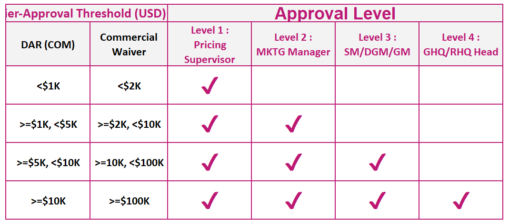
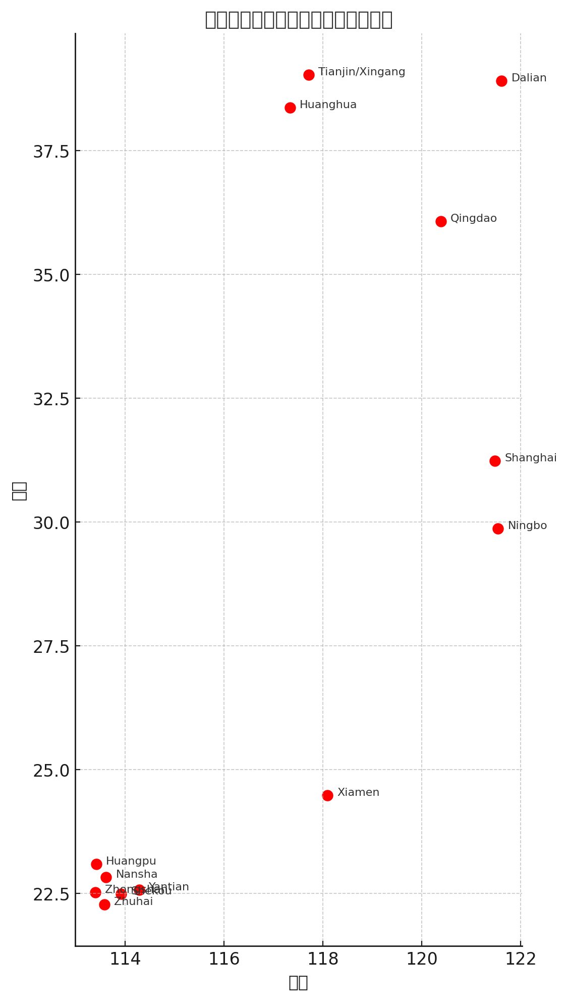

# WK31

- PUS出港の1週間前くらいにRoll Listを依頼する

- DARのWaiverできる金額範囲

## 

### Chile Pricing Handover（2025 年 8 月 5 日＋COA Report 4 Aug 2025 反映）

---

### 1. YTD 2025 取扱量・契約一覧（COA Report 4 Aug 2025 基準）

| Type | 顧客名 | Contract No. | YTD TEU | 主要条件・注意点（追加情報） |
| --- | --- | --- | --- | --- |
| **Long** | **Falabella Retail S.A.** | TSCLB00540A | **953** | BP: CL/PE/CO.
USD 1,800/2,000/1,400 (Super All-In)＋USD 50/TEUコミッション 
→ CM約 USD 675/TEU。
週 100 TEU＋20 %バッファ（最大120 TEU）。
AP Flex：同一ループ内で港配分自由／**Do-Not-Roll**。
契約〜2025/12/31。 |
|  | **Soc. de Transportes Pan South America** | SCLN01138A | 608 | NAC “Emu” (13 May 2025–31 Mar 2026)。
NAC: Inversierra (1 Apr 2025 - 31 Mar 2026)
XMN->IQQ FAKをWCSA水準へ揃える（ファッション貨限定）。 |
|  | **Sparx Logistics Chile** | SCLN00545A | 140 | 専用NAC “Tricot”。
Game Plan 70 % FAK : 30 % NAC厳守 ⇒ 55 %/45 %で超過中。特別CVCサーチャージ USD 95/100。 |
|  | **Multitiendas Corona** | TSCLB00258A | 134.8 | 破産済。RFA取消・水上貨は前払必須。 |
|  | **Cencosud S.A.** | SCLB01136A | 42 | SHA RFA (例: SHAB01748A) で契約切替済み。 |
|  | **Bon Voyage Logistics Chile** | SCLN01149A | 28 | AP Flex＋DNR（同ループ未消化分を他港へシフト可）。 |
| **Medium** | **Sumitomo Rubber Latin America** | TSCLB00345A | 26 | 四半期契約。現行 1 Jul–30 Sep 2025。値下げ要求なければ維持。 |
| **Short** | **Pan South** | SCLN00086A | **1,267** | 短期FAK大量。別NAC (SCLN01163A 56 TEU) “Inversierra” も併存。 |
|  | A. Hartrodt Chile | SCLN00283A | 324 | — |
|  | Empresas Demaria | SCL17A0146 | 256 | — |
|  | **Sparx Logistics Chile** | SCL01455 | 205 | 上記Tricot NACに加え別途短期契約あり。 |
|  | Industrias Cleaner Chile | SCLB00820A | 180 | NORレートをNPRC/EC NORをベンチマークし低値要望。 |
|  | Capital Logistics | SCLN00838A | 86 | TAO/IN発RHレートを毎月依頼。Valparaísoはドラフト制限で現在提示停止。 |
|  | Maritrans SPA | TSCLB00309A | 60 | XMN-IQQレート＝WCSA水準で揃え済み。 |
|  | Leschaco (Chile) | SCLN00149A | 55 | ファッション貨限定FAK調整あり。 |
|  | Cottonext | SCLB00849A | 52.98 | — |
|  | American Container Line | SCLN00284A | 51 | — |
|  | Expeditors Chile | SCLN00282A | 50 | — |
|  | Rohlig Chile | SCLN00290A | 44 | — |
|  | Andes Logistics | SCLN00562A | 40 | — |
|  | Emo-Trans Chile | SCLN00207A | 39 | — |
|  | DSV Air & Sea | SCLN01152A | 27 | — |
|  | Klog.co | SCLN00126A | 24 | CVCサーチャージ更新依頼多発。 |
|  | Cardinale S.A. | TSCLB00160A | 20.5 | — |
| **Grand Total** |  |  | **4,769 TEU** |  |

---

### 2. 主要運用・交渉ポイント（前回まとめ＋追加情報）

1. **Game Plan比率**
    - 基本指針：**70 % FAK / 30 % NAC**。超過例 → Sparx（55/45）。追加NAC要求時の牽制材料に。
2. **レート設定**
    - Little Oceanよりは高め、NPRC N・Ecuador NIRを併用ベンチマーク。
    - スペース逼迫時のアドホック依頼は原則FAK水準で回答。
3. **ドラフト問題**
    - **Valparaíso**：大型船・重量貨制限中。
    - Shanghai omit（AX2）継続中 → SHA→San Antonioの新規オファー不可。
4. **Falabella特有ルール**
    - **AP Flex** & **Do-Not-Roll** を厳守。ECMロール時は即対応。
5. **Pan South**
    - NAC複数・FAK連動依頼多い。ファッション貨に限定したS→EKレート調整を許容済み。
6. **Sparx**
    - Tricot NACのみ。Game Plan違反とCVCサーチャージ更新依頼が頻発。
7. **DND割引権限**
    - Adele USD 1,000／Sun Ang・Kazuki見込み USD 5,000。充分な根拠無しの場合は拒否。
8. **Free Time**
    - 標準21 days。延長要望は原則押し返す。
9. **Pushy PIC（チリ側）**
    - **Julio／Claudia／Belen／Loreto／Paula／Esmeralda** 等。数字・テーブルでの反証が有効。

---

### 南米の国

### 1. 地理的なグループ分けで覚える

まず、ラテンアメリカを大きく3つの地域（+メキシコ）に分けて、それぞれの地域ごとに国を覚えていく方法です。地図を見ながら位置関係も一緒に頭に入れると効果的です。

- **メキシコ** (1カ国)
    - 北アメリカ南部に位置する、ラテンアメリカの入り口とイメージしましょう。
- **中央アメリカ** (7カ国)
    - メキシコの南、南米大陸の北に位置する細長い地域です。北から順に覚えるのがおすすめです。
- **カリブ海諸国** (スペイン語圏を中心に)
    - 島国が多く、音楽やリゾートのイメージが強い地域です。
- **南アメリカ** (12カ国 ※フランス領ギアナを除く)
    - 大陸の形や主要な山脈（アンデス山脈）、川（アマゾン川）と関連付けて覚えると良いでしょう。

### 2. 国名の頭文字を使った語呂合わせや連想

**中央アメリカ (北から順に)**

- **グ**アテマラ、**ベ**リーズ、**エ**ルサルバドル、**ホ**ンジュラス、**ニ**カラグア、**コ**スタリカ、**パ**ナマ
    - 例：「**グベエホニコパ**」と呪文のように覚える。
    - ストーリーで覚える：「**グ**ーグルで**ベ**ンチ探す**え**らい**ホ**ビット、**ニ**コニコ**コ**ーヒー**パ**ンと飲む」

**南アメリカ**

南米大陸は国が多いので、いくつかのグループに分けたり、特徴と結びつけたりするのがおすすめです。

- **アンデス諸国** (西側の山脈沿い): **コロンビア、エクアドル、ペルー、ボリビア、チリ**
    - 「**コーヒー、行く？ペルーでボート、地理**は任せて！」 (コーヒー＝コロンビア、行く＝エクアドル、ペルー、ボート＝ボリビア、地理＝チリ)
- **ギアナ三国** (北東部): **ガイアナ、スリナム、フランス領ギアナ** (※フランス領ギアナはフランスの海外県ですが、地理的にここに位置します)
    - 「**ガイ**ドの**スリ**ちゃん、**フラ**ンスへ」
- **アマゾン川流域/内陸国**: **ブラジル、パラグアイ、ウルグアイ**
    - ブラジルは巨大なので単独で。
    - 「**パラ**パラ雨の**ウル**グアイ」
- **南端**: **アルゼンチン**
    - タンゴやパタゴニアのイメージ。

**カリブ海諸国 (主なスペイン語圏)**

- **キューバ、ドミニカ共和国、プエルトリコ** (アメリカ自治連邦区)
    - 「**急**に**ド**アが**プ**ルプル」

### 3. 各国の「顔」となる特徴と結びつける

それぞれの国を代表する文化、産物、有名人、観光地などと結びつけて覚える方法です。

- **メキシコ**: タコス、マヤ・アステカ文明、カンクン
- **グアテマラ**: マヤ文明ティカル遺跡、コーヒー
- **ベリーズ**: グレート・ブルーホール (ダイビングスポット)
- **エルサルバドル**: 火山が多い、コーヒー
- **ホンジュラス**: コパン遺跡 (マヤ文明)
- **ニカラグア**: ニカラグア湖 (淡水サメが生息)
- **コスタリカ**: 「軍隊を持たない国」、豊かな自然 (エコツーリズム)
- **パナマ**: パナマ運河、パナマ帽 (実はエクアドル発祥ですが…)
- **キューバ**: 葉巻、クラシックカー、サルサ音楽、野球
- **ドミニカ共和国**: メレンゲ (音楽・ダンス)、野球、リゾート
- **プエルトリコ**: レゲトン (音楽)、ラム酒
- **コロンビア**: コーヒー、エメラルド、シャキーラ (歌手)
- **ベネズエラ**: エンジェルフォール (世界最大の落差の滝)、石油
- **エクアドル**: ガラパゴス諸島、赤道 (国名の由来)
- **ペルー**: マチュピチュ遺跡、ナスカの地上絵、アルパカ
- **ボリビア**: ウユニ塩湖、ラパス (世界最高地点にある首都)
- **チリ**: 細長い国土、イースター島 (モアイ像)、ワイン、アタカマ砂漠
- **アルゼンチン**: タンゴ、パタゴニア地方、メッシ (サッカー選手)、牛肉
- **パラグアイ**: イグアスの滝 (一部)、大豆生産
- **ウルグアイ**: 牛肉、マテ茶、南米の優等生 (比較的治安が良い)
- **ブラジル**: サッカー、サンバ、アマゾン川、コーヒー、リオのカーニバル
- **ガイアナ**: (英語圏) ジョーンズタウン (歴史的事件)
- **スリナム**: (オランダ語圏) 多様な文化
- **ハイチ**: (フランス語・クレオール語圏) カリブ海初の独立黒人共和国

| 港名 | 港コード | 主な特徴 |
| --- | --- | --- |
| **Shanghai（上海）** | CNSHA | 世界最大級のコンテナ取扱量。Yangshan深水港を含み、グローバルハブ港として機能。 |
| **Ningbo（寧波）** | CNNGB | 東中国最大の港の一つ。深水港・高速接続で、北米・欧州・南米向けの幹線航路が多数。 |
| **Yantian（塩田）** | CNYTN | 深圳港の一部。深水バース多数、米州向けメガシップに対応。 |
| **Shekou（蛇口）** | CNSHK | 深圳港の一部。華南地域の内陸部接続に強み。中南米・アジア域内線多め。 |
| **Nansha（南沙）** | CNNSN | 広州港の一部。華南内陸部と珠江デルタの接点、ターミナル近代化進行中。 |
| **Qingdao（青島）** | CNTAO | 北方最大級。韓国・日本との接続が強く、黄海の中心港。 |
| **Tianjin / Xingang（天津/新港）** | CNXGG | 北京の外港。内陸物流と結ぶ北中国のゲートウェイ。 |
| **Dalian（大連）** | CNDLC | 遼寧省の港。日本・韓国とのフィーダー網が発達。冷凍貨物流通あり。 |
| **Xiamen（厦門）** | CNXMN | 福建省の港。台湾・東南アジアとの接続が多い。ターミナル効率高。 |
| **Huangpu（黄埔）** | CNHPH | 広州港の一部。河川系港として小型船に対応。 |
| **Huanghua（黄驊）** | CNHUA | 河北省の港。主にバルク貨物が中心だが、コンテナ化進行中。 |
| **Zhuhai（珠海）** | CNZUH | 珠江デルタ西岸、マカオ隣接。近距離輸送に強み。 |
| **Zhongshan（中山）** | CNZSN | 内陸港として内航・支線輸送に特化。 |
- Tianjin/Xingang（CNXGG）
- Huanghua（CNHUA）
- Dalian（CNDLC）
- Qingdao（CNTAO）
- Shanghai（CNSHA）
- Ningbo（CNNGB）
- Xiamen（CNXMN）
- Shekou（CNSHK）
- Yantian（CNYTN）
- Nansha（CNNSN）
- Huangpu（CNHPH）
- Zhuhai（CNZUH）
- Zhongshan（CNZSN）

- DNRリストを受領

[DNR list.xlsx](WK31/DNR_list.xlsx)

- ONE船のときはStanbylistを送るときにPlannerをCCにいれる
-