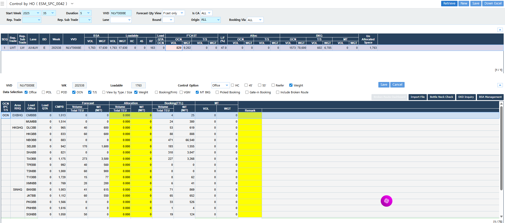

# WK35-WK37

- Wayport
    - TDRは本来シェアフォルダ直下にある
    - TDRでなくてもLong Range SKDで前のVVDを調べる
    - Control by HOでそのVVDを調べるで確認できる
- CGM
- AllocationはMaster Constraint Tableだけを更新しても反映されない。別途マニュアルでControl by HOから更新
    - Forecastを見ながらアレンジしてもOK

- VeracruzにはOfferしない
    - 私たちは今後、MXVER/MXATMの提供を行いません。PAMIT-COCNRからのルーティングはなく、CX3経由のみですが、割り当てが少なく、LEでも使用に十分ではありません。
- 絶対ロールしない顧客
    - a/c Standard Motor Products (Four Seasons)

- Space Control
    - Ningbo, Shanghai, PusanはAllocationを使うけど、その他はBookingの数値を使うのはなぜ
        - 3つはベースポート、最後の最後までFlesh bookingの数値は確定しないからAllocationを使う
        - その他は結局3つのベースポートに運んでいるので、BookingがかなりFirm
            - CNのポートはすべてPusanに運ぶ、上海やニンボウにはカボタージュで持っていけない
        - 
        
        
        

メモ

		

- ECのAHA charge
- Please note that Pluscargo has a local concession AHA Fixed USD 50 but we affect this concession in OFT. Therefore, AHA is 112 - 50 = 62 If the OFT is 1500 - 62 = 1438.

- 

Please add on USD700/teu for DG class 1.
Cargo acceptance as usual subjected to DG desk approval.

- MXのInland Tender
    - Inland部分はここから調べる
    - 

- 右端のRemarkがAll TruckとFull round tripを選ぶ
- 2026年に向けては10%追加

- MRGはOBS以外はInclude
- Q4レートの見積もり
    - China base portからは2000ドル
    - Ex Japanは200/2800/2800
    - 

- Food grade - please add on Usd100/unit

- Plug Inのコストを確認する方法

- Break even pointは1800ドル/TEUこのときのCMは670ドル。FEUにするとその倍の1300くらいのCMが必要
- Subject to RRで月の途中で上がった場合はこれをとるようにする。これをハイライトする

- Why is SVAQJ booking via AX1 - we need to fulfil on MX2 via MXLZC or AX4 only.
- SVAQJ to be routed via MX2
- 非FMCはOnboardingの日付がBookingの日付になる
- 
- Please refer to the FAK MRG for IDSUB-MXZLO and add on Usd100/unit on top of FAK for flexitank.

- 

MX2サービス（Lazaro Cardenas–Acajutla間のフィーダー【参考：MX2スライド参照【7†LATIN AMERICA MAPS_20250521.pdf†L1495-L1515】】）について、

Pei Sanから以下の提案がありました。

- 現在のBSA（船腹保証）は **356 TEU/bi-weekly（＝178 TEU/週）**。
- 直近6か月の実績は **217 TEU/週** と、割り当てを上回る実績を維持している。
- そのため、BSAを **178→200 TEU/週** に引き上げたいとの要請。

Simonがこれを了承し、

**「bi-weeklyで400 TEU（＝200 TEU/週）」へアップグレード可** と返信した。

- We do not offer 45' containers into LAWC.

- We don't call CLANF.

- DARを断るとき

It is not the fault of ONE.
Please decline tactfully.