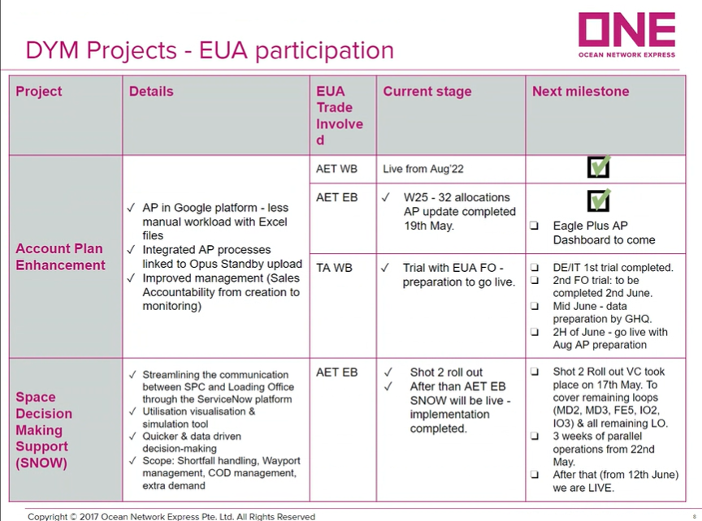

# EU

新ITSシステム

顧客のコード自体が間違っている場合があるので、それの修正としてすべてのコードを参考として表示するようにする

TTのマッピングがあるのにうまくマッピングがされていない場合はどうすればいいか

複数シートがある場合に、チェックシートを埋めるのが難しい（例えばすべてのシートでGroup customerを埋めないといけないのか）

Pricerへのメール転送は将来的に自動化されないのか

Opusコードが存在しないPortがEUAでは多く存在する→Inlandとして取り扱わないといけない

大きいTenderを対象にいれたい
→オフショアでEuropeに閉じれるものも対象にいれる
EUA trade related

RHQ controlled offshore account

Last year nominationをConvertしてAwardにいれたい

Route portfolio sumilationとPricingのAccount
ー＞すべて同じにしたい

### Inland

End of Juneに新ITSができるがその後にチェックが必要

Referはまだだが、これからEagle Xに加えることもできる
ITSはTransit timeはもっていないがWihslistにはある
Co2 emmisionも
EuropeではCo2 commisonの関心が非常に高まっている

City nameで検索して、Zip codeがあればZip codeも見ている
Zip codeがないときはCity nameだけ

OPUS codeがない場合はSalesにCity name/Zip codeを訪ねてもらう方がいい
→本当にこれができるかは懐疑的だ（Kasia）

Verge1
Rail2
Truck３

時間を短くしたい場合は追加コストいくらみたいな提示がVendorからある場合は顧客の要望に応じてコストを追加している

Inland remarkが欲しい

Initial check inにMerchandise's inspired carrier's haulageのケース

Mars

Covestro

Nike

Epson

BMWなど

IOPも６人いる

Summaryとしてコメントが欲しい

やりたいTender

IKEA

CATAPIRA:

DHL

Mishulane

Samusung

BASF

Top volume customer

AFLA

### PUDO

- R1はPUDO Mandateを使っている
- 

[Eagle X plan](EU/Eagle%20X%20plan%209c0fd5b4115f470c97f369cba44f2372.md)