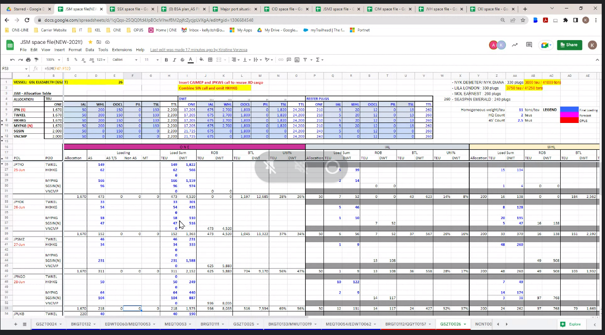

# #6

- Partner infoはSeparateではなくサマられて表示される
    - JVHでは１つしかないからOKだが将来的に他のIntra Asiaのレーンに展開するときには必要になる
    - パートナーごとの詳細で問い合わせたりするのでその情報は必要
    - When必要？ー＞２Days before at least
    - Quite accurateなForcast
    - Maximamu 4-5のPartnerがある
    
    
    
- ROBはBookingとWayport requestでAcceptされたものが含まれるべき
-