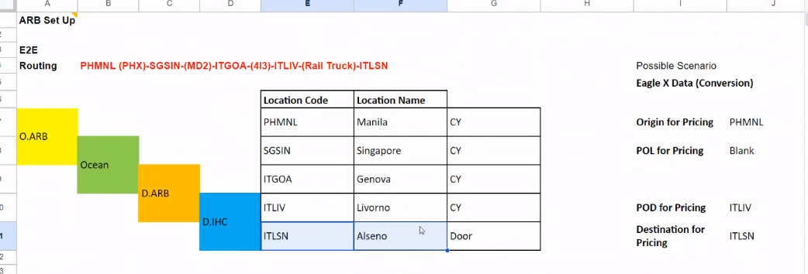

# ARB

IHC:inland haulage -> Door location, Rail CY to Doorも

Arbitary:Inland port、Inland CYはArbitrary、Normally CY

Origin ARB -> Ocean -> Destination ARB -> Destination IHC

TPの場合はO.ARBからD.ARBまでをOceanとすることがある

TPの顧客はFeederとか細かいことを気にしない

