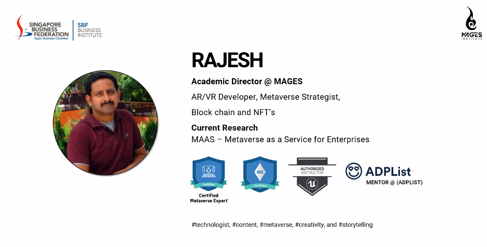

# #1

## ＜**Create brand awareness via metaverse**＞

Design product->Shop, e-commerce

アバターは今のところLinkされていない

2wayじゃない

Web2.0はBig techがデータを支配してマネタイズしていた

Ownershipを持てることが大きな違い

Constantly communicate community

targetはConsumerからAvatorへ

音楽コンサート、ファッションなどのライブイベントが活発

Databaseに近い

ARはMetaverseのGateway

[Metaverse Full-Body Online 3D Avatar Creator | Ready Player Me](https://readyplayer.me/)

